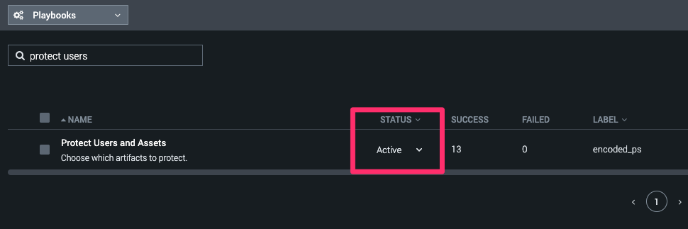

# Mission Control Remediation

After adding the playbooks to Splunk Soar and updating the Response Plan you can launch an embeded playbook during the "Render Verdict" phase to automatically contain assets. By saying "no" to one of the actions still gives you the ability to follow-up with an "ad-hoc" action to contain an artifact.

## How do I use these playbooks?

- [Add this repo as a Git source to Splunk SOAR](#add-this-repo-to-soar).
- [Add the "Protect Users and Assets" to the Encoded PowerShell Detection Response plan](#add-playbook-to-response-plan-in-mission-control).

### Add this repo to SOAR

1. In Splunk Soar, Navigate to Administration > Administration Settings > Source Control
2. From the "Repositories" drop down, select "Configure a new repository."
3. Repo URL: `https://github.com/ZachTheSplunker/mission-control-demo.git` 
4. Branch Name: `main`
5. Check (Enable) "Read Only"
6. Save Changes

### Set playbook to "Active"

1. In Splunk Soar, navigate to Playbooks.
2. Using the filter textbox, type "Protect Users."
3. Set the "Protect Users and Assets" playbook to be "Active" using the Status dropdown.

### Add playbook to Response plan in Mission Control

1. In Mission Control, Navigate to Content.
2. Select the Response Plan "Encoded PowerShell Detection Response."
3. For the "Render Verdict" phase, Select the task "Take Remediation Action or Close Incident."
4. Add the Playbook `Protect Users and Assets` to the task. 

### Running the playbook

The playbook will automatically execute for the encoded powershell incident. You will have to manually click the "bell" icon in the upper right of the screen to reveal the notifications. You can then select the prompt.
