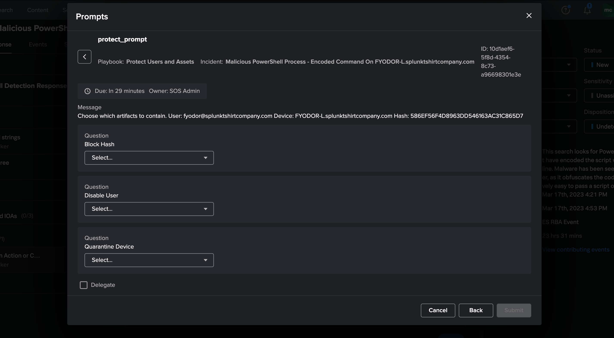

# Mission Control Remediation

After adding the playbooks to Splunk Soar and updating the Response Plan you can launch an embeded playbook during the "Render Verdict" phase to automatically contain assets. By saying "no" to one of the actions still gives you the ability to follow-up with an "ad-hoc" action to contain an artifact.

## How do I use these playbooks?

1. [Add this repo as a Git source to Splunk SOAR](start/index.md#add-this-repo-to-soar).
2. [Set playbook to be Active in Splunk SOAR](start/index.md#set-playbook-to-active)
3. [Add the "Protect Users and Assets" to the Encoded PowerShell Detection Response plan](start/index.md#add-playbook-to-response-plan-in-mission-control).

## How will it work?

The playbook will automatically execute for the encoded powershell incident. You will have to manually click the "bell" icon in the upper right of the screen to reveal the notifications. You can then select the prompt.
