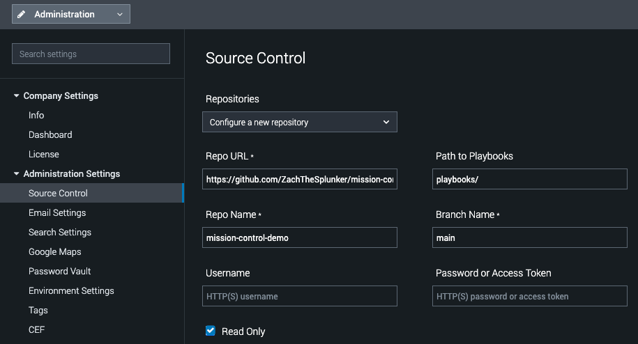

## Add this repo to SOAR

1. In **Splunk Soar**, Navigate to **Administration** > **Administration Settings** > **Source Control**
2. From the "Repositories" drop down, select "Configure a new repository."
3. Enter the following:

||| Repo URL 
```
https://github.com/ZachTheSplunker/mission-control-demo.git
```
|||

||| Path to Playbooks
```
playbooks
```
|||

||| Repo Name
```
main
```
|||

||| Read Only
:icon-check: True (checked)
|||

!!!warning
Don't forget to save your changes
!!! 



## Set playbook to "Active"

1. In **Splunk Soar**, navigate to **Playbooks**.
2. Using the filter textbox, type "Protect Users."
3. Set the "Protect Users and Assets" playbook to be "Active" using the Status dropdown.


## Add playbook to Response plan in Mission Control

1. In **Mission Control**, Navigate to **Content**.
2. Select the Response Plan "Encoded PowerShell Detection Response."
3. For the "Render Verdict" phase, Select the task "Take Remediation Action or Close Incident."
4. Add the Playbook `Protect Users and Assets` to the task. 
5. Save the respone template.

